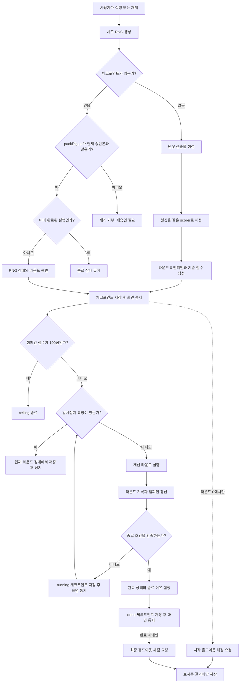
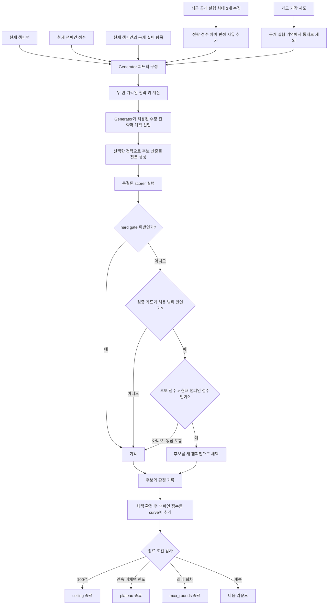
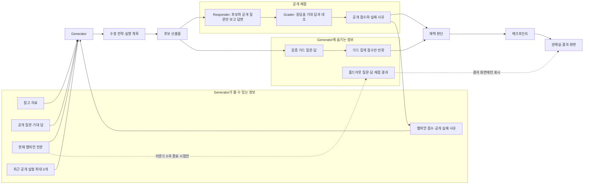
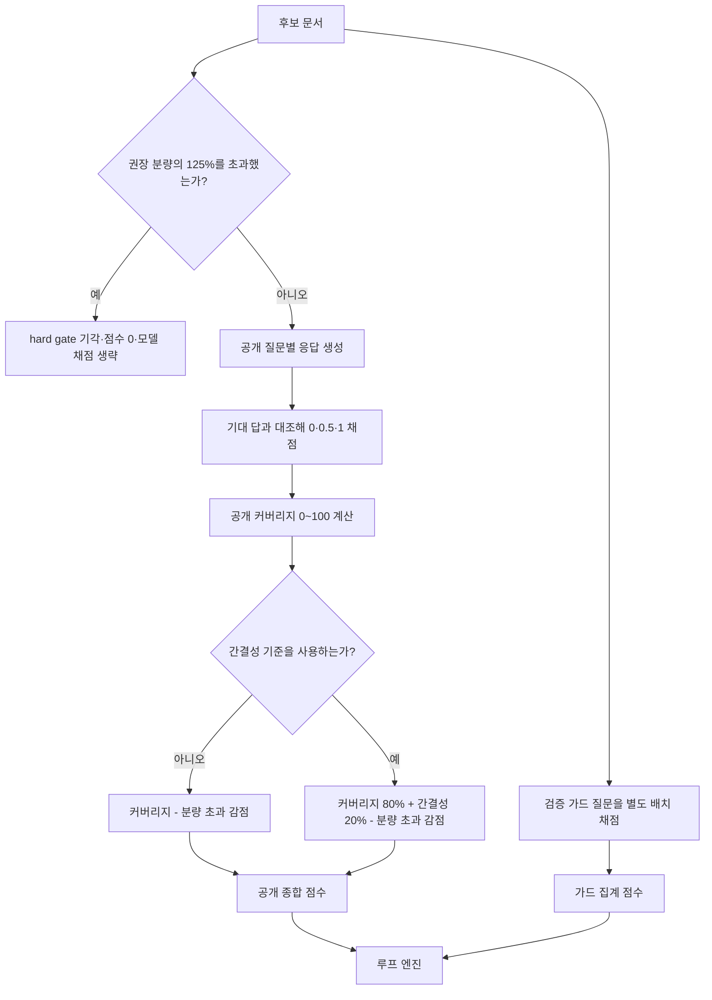

# 현재 루프 구조

이 문서는 `main`에 구현된 반복 개선 구조를 코드 기준으로 정리한 설명 문서다. 공통 루프 엔진과
인수인계 템플릿의 생성·채점 구현을 함께 다루되, 둘의 책임은 구분한다. 정책과 불변식의 정본은
[`SPEC.md`](../SPEC.md), 필드와 실행 계약의 정본은 `packages/contracts`이며, 이 문서와 코드가
어긋나면 코드와 계약이 우선한다. 각 절이 가리키는 구현 위치는 §8에 있다.

## 1. 전체 실행 흐름

홀드아웃 채점은 `createLoopRun` 내부가 아니라 웹 앱의 실행 컨트롤러(`runController`)가 체크포인트
통지를 받아 실행한다. 시작과 종료 챔피언을 지역 변수로 캡처해 채점하며, 그 결과는 생성·채택·중단
판단으로 돌아가지 않는다. 라운드 0에서 곧바로 상한 종료되면 시작·종료 산출물이 같으므로 시작
채점 결과를 종료 결과로 재사용해 한 번만 잰다. 실행 세션은 화면이 아니라 프로젝트에 묶여 있어
관제실 화면을 벗어나도 계속 돌고, 돌아오면 같은 세션에 다시 붙는다 — 정지는 사용자의 버튼만 요청한다.

라운드 0에서는 원샷 생성 → 채점 → 첫 체크포인트 저장 순서로 진행한다. 채점이나 저장이 실패하면
점수 없는 체크포인트는 계약상 만들 수 없으므로 아무것도 저장되지 않지만, 가장 비싼 호출인 원샷
산출물은 핸들 수명 동안 보관해 같은 핸들의 다음 `start()`가 재생성 없이 채점부터 잇는다(RNG 상태도
원샷 직후 값으로 되돌려 새 실행과 같은 수열을 유지한다). 원샷 생성 호출 자체가 실패했거나 새로고침으로
핸들이 사라졌으면 보관할 산출물이 없어 원샷부터 다시 만든다. 화면은 핸들의 `hasPendingInitial()`로 두
경우를 구분해, 앞의 경우 "새로고침 전까지는 처음 산출물을 다시 만들지 않고 채점부터 이어갑니다", 뒤의
경우 "처음 산출물부터 다시 만듭니다(추가 비용 발생)"라고 안내한다.

## 2. 한 라운드의 생성과 채택 판단

현재 인수인계 템플릿은 `feedbackMode`를 `recent_public_experiments_v1`으로 설정한다.
가드 비퇴보 조건을 통과한 최근 공개 실험 최대 3개의 아래 정보가 다음 전략 선택과 후보 생성
프롬프트에 들어간다.

- Generator가 후보 생성 전에 선언한 전략 키와 구체적인 실행 계획
- 후보 점수와 당시 챔피언 대비 점수 차이
- 채택 여부
- hard gate 기각 여부
- 공개 기준에서 나온 실패 사유

최근 공개 실험 안에서 같은 전략이 두 번 기각되면 그 전략 키는 다음 계획에서 차단된다. 차단은
다양성을 위한 휴리스틱이지 불변식이 아니어서, 차단된 전략을 거듭 고르더라도 실행을 중단하지
않는다 — 계층별 처리는 §6에 있다.

검증 가드에서 기각된 후보는 공개 점수가 좋아 보이더라도 직전 시도 피드백에서 통째로 제외한다.
가드 결과로부터 비공개 질문의 성질을 역추론하는 통로를 만들지 않기 위해서다.

## 3. 정보가 흐르는 경계

주의할 점은 검증 가드와 홀드아웃의 역할이 다르다는 것이다.

- 검증 가드: 매 라운드 집계 점수만 채택 판단에 사용한다.
- 홀드아웃: 라운드 0과 최종 결과만 채점하며, 루프 판단에는 사용하지 않는다.
- 두 경로 모두 개별 질문과 판정 트레이스를 Generator에 전달하지 않는다.

## 4. 현재 인수인계 scorer

인수인계 템플릿의 공개 점수는 현재 다음 순서로 계산된다.

분량은 권장 상한을 넘는 즉시 실격되지 않는다. 권장 상한부터 125%까지 최대 20점을 선형으로
감점하고, 125%를 넘었을 때만 비용·출력 폭주를 막기 위한 hard gate로 기각한다. 이 정책은
`soft_overflow_v1` 식별자로 승인된 평가 구성에 결속된다.

## 5. 체크포인트에 남는 것

매 라운드와 상태 전이에서 먼저 체크포인트를 저장한 뒤 화면에 통지한다.

| 영역 | 저장 내용 |
| --- | --- |
| 현재 상태 | `status`, `round`, `doneReason` |
| 챔피언 | 산출물, 공개 점수, 공개 실패 사유, 가드 집계 점수 |
| 개선 곡선 | 라운드별 채택 확정 후 챔피언 점수 |
| 가드 곡선 | 라운드별 채택 확정 후 챔피언 가드 점수 |
| 시도 기록 | 후보 점수, 채택 여부, gate 여부, 공개 실패 사유, 가드 통과 여부 |
| 수정 전략 | 템플릿 전략 키와 후보 생성 전에 선언한 구체적인 실행 계획 |
| 재개 정보 | `packDigest`, RNG 내부 상태 |
| 감사 기록 | 시작, 라운드 판정, 채택, 정지, 재개, 종료 사건 |

`curve`에는 모든 후보 점수가 아니라 각 라운드가 끝난 뒤의 챔피언 점수가 들어간다. 따라서
엄격 개선 채택 규칙 아래에서 곡선은 내려가지 않는다. 기각된 후보의 실제 점수는 `tree`에
별도로 남는다.

체크포인트 저장은 라운드 계산 뒤 `commit` 단계에서 일어나며, 여기서 IndexedDB 저장이 실패하면
엔진은 모델 오류와 구분되는 `CheckpointSaveError`를 던진다. 화면은 이를 "저장되었습니다"로
오안내하지 않고 저장 공간 확인을 권하며, 재시도는 마지막으로 저장된 회차부터 잇는다.

같은 브라우저에서는 쓰기 잠금(Web Locks)을 쥔 탭 하나만 프로젝트 스냅샷과 체크포인트를 저장한다.
잠금을 얻지 못한 탭은 읽기 전용으로 동작해 저장·승인·시작·재개를 하지 않고 어떤 모델 호출도 내지
않으며(위저드의 연결 확인·케이스 초안, 빌더의 템플릿 생성, 복구 홀드아웃 채점 포함), 상단에 그 사실을
표시한다. Web Locks가 없는 환경(비보안 컨텍스트 `http://`, 구형 브라우저)에서는 `localStorage`
임대가 잠금을 대신한다 — 탭 ID와 만료 시각(15초)을 적고 되읽어 같은 순간의 경합을 가리며 5초마다
갱신한다. 갱신 중 다른 탭의 임대가 보이면(이 탭이 오래 멈춘 사이 만료를 보고 가져감) 스냅샷 충돌과
같은 경로로 읽기 전용으로 물러난다. 잠금 실패를 소유권으로 취급하지 않는 이유는 체크포인트 저장소에
판 번호 비교가 없어, 소유 탭이 둘이면 같은 일시정지 실행을 동시에 재개해 모델 호출이 겹치기 때문이다.
저장소조차 없는 환경에서 스냅샷 충돌로 뒤늦게 읽기 전용이 된 탭은 진행 중이던 라운드를 마쳐도
체크포인트를 쓰지 않는다 — 컨텍스트가 내주는 저장소가 읽기 전용 탭의 save를 거부한다. 잠금을 쥔 탭은 복원 시점에 현재 프로젝트의 `runId` 외 체크포인트를 고아로 보고 한꺼번에
지운다(`deleteExcept`) — 재컴파일·초기화로 폐기된 실행이 진행 중 라운드의 지연 저장으로 되살아나도
다음 로드에서 걷힌다.

화면의 점수 그래프는 첫 챔피언 점수를 5점 단위로 내림한 값을 y축 하한으로 사용한다. 예를
들어 첫 점수가 67.3점이면 65~100점 범위로 확대해 그린다. 이는 저장 점수와 채택 계산을
바꾸지 않는 표시 전용 변환이다.

## 6. 현재 종료 조건

종료 조건은 다음 우선순위로 검사한다.

1. 챔피언이 100점에 도달하면 `ceiling` 종료
2. 연속 미채택 횟수가 `plateauRounds`에 도달하면 `plateau` 종료
3. 실행한 라운드가 `maxRounds`에 도달하면 `max_rounds` 종료

인수인계 템플릿의 현재 기본값은 최대 8라운드, 연속 미채택 4라운드다. 일시정지는 실행 중인
생성이나 채점을 취소하지 않고, 그 라운드를 기록한 다음 다음 라운드 시작 경계에서 적용된다.

라운드 도중 모델 호출이나 채점 형식에서 오류가 나면 그 라운드는 `tree`·`curve`·`round`에 남지
않는다. 엔진은 직전 라운드 경계 상태를 `paused`로 저장하고 `error` 사건에 사유를 적은 뒤 오류를
던진다. 화면은 오류 문구를 보여주고 사용자는 같은 체크포인트에서 재개한다.

차단된 전략 키를 거듭 고른 경우는 라운드 실패가 아니며, 계층마다 다음과 같이 처리한다.

1. **엔진 계층** — `planStrategy`가 차단 키를 *반환*하면 한 번 더 계획하게 하고, 그래도 같으면
   `round` 사건에 사유를 남기고 그 라운드는 전략 없이 생성한다. 실행을 통째로 중단하지는 않는다.
2. **인수인계 계획기** — `parseStrategy`가 차단 키를 형식 오류의 하위 오류(`BlockedStrategyError`)로
   던져 형식 수정 요청 1회를 받고, 재시도 뒤에도 차단 키면 예외를 던지는 대신 차단되지 않은 첫
   전략(`HANDOVER_STRATEGIES` 순서, 천장 차단이면 `tighten`)으로 대체해 반환하며 대체 사유를
   `summary`에 남겨 라운드 기록에서 보이게 한다. 따라서 인수인계 템플릿에서는 엔진의 "전략 없이
   생성" 경로에 이르지 않고, 형식 오류만 라운드 실패(일시정지)로 이어진다.

## 7. 개선 검토 시 볼 지점

아래는 현행 구현에서 개선안을 논의할 때 선택할 수 있는 지점이다. 아직 특정 변경을 제안하거나
적용했다는 뜻은 아니다.

- Generator 입력: 최근 공개 실험 3개의 분량과 구성만으로 충분한지
- 후보 생성: 매번 문서 전문을 다시 만드는 방식과 부분 수정 방식의 비용·안정성 차이
- 채택 민감도: 0보다 큰 점수 차이를 모두 개선으로 볼지, LLM 채점 변동성을 별도로 다룰지
- 정체 판정: gate 기각, 가드 기각, 점수 미개선을 같은 미채택으로 셀지
- 전략 다양성: 같은 전략 2회 기각 시 차단하는 현재 기준과 전략 분류가 적절한지
- 관측성: 챔피언 곡선과 기각 후보 기록이 사용자가 개선 과정을 판단하기에 충분한지
- 비용: 공개 채점과 가드 채점을 매 라운드 모두 수행하는 현재 호출 구조를 유지할지

## 8. 구현 위치

- 공통 루프 상태 머신: [`packages/loop-engine/src/engine.ts`](../packages/loop-engine/src/engine.ts)
- Generator 피드백 계약: [`packages/loop-engine/src/index.ts`](../packages/loop-engine/src/index.ts)
- 체크포인트·점수 계약: [`packages/contracts/src/loop.ts`](../packages/contracts/src/loop.ts)
- 인수인계 생성·채점: [`templates/handover/src/runtime.ts`](../templates/handover/src/runtime.ts)
- 인수인계 프롬프트: [`templates/handover/src/prompts.ts`](../templates/handover/src/prompts.ts)
- 분량 정책: [`templates/handover/src/length.ts`](../templates/handover/src/length.ts)
- 실행 세션·홀드아웃 채점 스케줄: [`apps/web/src/lib/runController.ts`](../apps/web/src/lib/runController.ts)
- 탭 간 쓰기 잠금: [`apps/web/src/lib/projectLock.ts`](../apps/web/src/lib/projectLock.ts)
- 관제실 화면(구독·표시·버튼): [`apps/web/src/pages/ConsolePage.tsx`](../apps/web/src/pages/ConsolePage.tsx)
