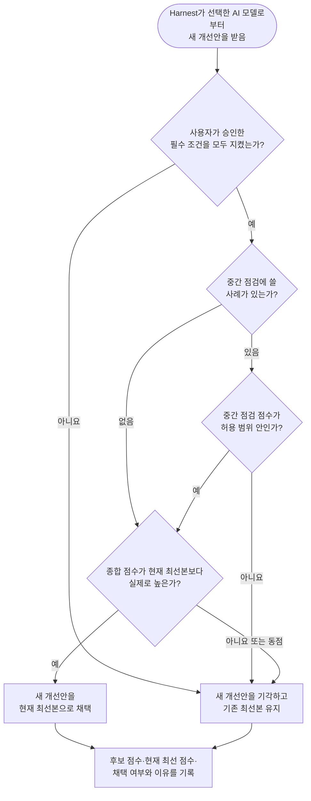

# Harnest 전체 사용자 시나리오

Harnest는 사용자가 먼저 좋은 결과의 기준을 확인하고 승인하면, AI가 그 기준을 바꾸지 못하게
보호하면서 AI가 결과물을 만들고 평가해 점수를 높이며 그 과정을 근거와 함께 보여주는 서비스다.

## 목차

1. [서비스가 해결하는 문제](#1-서비스가-해결하는-문제)
2. [서비스의 핵심 기능](#2-서비스의-핵심-기능)
3. [전체 사용자 시나리오](#3-전체-사용자-시나리오)
4. [시나리오를 관통하는 핵심 문장](#4-시나리오를-관통하는-핵심-문장)

## 1. 서비스가 해결하는 문제

AI는 결과물을 빠르게 만들 수 있지만, 여러 번 수정한 결과가 처음보다 실제로 좋아졌는지는 쉽게
확인하기 어렵다. 수정할 때마다 평가 기준까지 달라지거나, 일부 사례에만 맞춘 결과가 더 좋아진
것처럼 보일 수도 있기 때문이다.

Harnest는 다음 질문에 답한다.

- 무엇을 좋은 결과로 판단했는가?
- 사용자가 승인한 평가 구성이 개선 도중 바뀌지 않았는가?
- 새 개선안이 이전 결과보다 실제로 나아졌는가?
- 개선 과정에서 사용하지 않은 사례에서도 결과가 유지되는가?
- 어떤 개선안이 채택되거나 기각됐으며, 그 이유는 무엇인가?

## 2. 서비스의 핵심 기능

### 사용자가 평가 기준과 전체 구성을 먼저 결정한다

사용자가 결과물, 실제 사례, 반드시 지킬 조건을 입력하면 Harnest가 평가 기준과 전체 평가 구성을 만든다.
사용자는 실행 전에 평가 기준과 비용, 사례의 출처와 사용 방법을 확인하고 승인한다.

### 승인한 평가 구성을 개선 과정에서 보호한다

승인된 평가 기준, 필수 조건, 채점 방식과 사례 분할은 하나의 규칙 묶음으로 잠긴다. 이 가운데
하나라도 바뀌면 기존 승인은 더 이상 유효하지 않으며, 사용자가 변경된 내용을 다시 확인하고
승인해야 한다.

### 처음 결과와 개선 결과를 같은 방법으로 비교한다

처음 만든 결과물을 출발점으로 기록한 뒤, 같은 평가 구성으로 새 개선안을 반복해서 시험한다.
필수 조건을 어기거나 기존 결과보다 점수가 높아지지 않은 개선안은 채택하지 않는다.

### 한 부분을 고치다가 다른 부분이 나빠지는 것을 막는다

매 개선 단계마다 별도로 떼어 둔 확인 사례를 이용해 중요한 품질이 허용 범위보다 떨어지지
않았는지 확인한다. 이 사례의 세부 내용과 평가 이유는 개선안을 만드는 AI에게 전달하지 않는다.

### 개선 과정에서 보지 않은 사례로 마지막에 다시 확인한다

최종 확인용 사례는 개선안을 만들거나 채택하는 데 사용하지 않는다. 처음과 모든 개선이 끝난
시점에만 같은 사례로 평가해, 화면에 보인 점수 상승이 새로운 상황에서도 유지되는지 보여준다.

### 채택과 기각의 이유를 숨기지 않는다

최종 결과만 보여주는 대신 처음 점수, 단계별 후보 점수, 현재 최선의 점수, 채택 여부와 기각
이유를 함께 기록한다. 적용된 보호 장치와 생략된 절차, 측정의 한계도 결과에 표시한다.

### 사용자가 데이터와 실행을 통제한다

사용자는 진행 상황을 확인하고 현재 개선 단계가 끝난 뒤 안전하게 일시정지하거나 재개할 수 있다. 개인
API 키는 브라우저에 보관하고, AI 요청은 기본적으로 브라우저에서 선택한 AI 서비스로 직접 보낸다.
프로젝트와 결과는 사용자가 명시적으로 선택한 경우에만 서버에 기록한다.

## 3. 전체 사용자 시나리오

아래 흐름은 특정 템플릿이나 예시에 기대지 않고 Harnest 전체를 관통하는 비개발자 사용자
시나리오다. 각 단계에는 행동의 주체, 행동이 일어나는 곳, 행동의 대상을 함께 적었다.

| 주체 | 목표와 책임 | 다루는 대상 |
|---|---|---|
| 사용자 | 좋은 결과의 기준과 평가 구성을 정하고 승인하며 진행과 결과를 통제한다 | 원본 자료, 실제 사례, 필수 조건, 평가 구성, 최종 결과 |
| Harnest | 사용자가 승인한 방법으로 전체 과정을 진행하고 변경과 결과를 기록한다 | 평가 규칙 묶음, 개선 단계, 점수, 진행 기록 |
| 사용자가 선택한 AI 모델 | 허용된 정보를 바탕으로 결과물을 만들고, 승인된 평가 구성에 따라 결과물을 평가한다 | 생성 시에는 현재 결과물과 공개된 평가 이유, 평가 시에는 평가 대상 결과물과 해당 단계에 허용된 사례 |

같은 상자 안에서 여러 주체가 차례로 행동하지 않도록, 주체가 바뀌는 지점은 별도 단계로
분리했다.

### 전체 여정

```mermaid
sequenceDiagram
    autonumber
    actor U as 사용자
    participant H as Harnest
    participant M as 선택한 AI 모델

    Note over U,M: 1. 준비
    U->>H: 시작 화면에서 만들거나 개선할 결과물의 종류 선택
    U->>H: 프로젝트 입력 단계에 원본 자료·첨부 파일·원하는 결과 제출
    U->>H: 조건 항목에 분량 등 반드시 지킬 내용 입력
    opt 선택한 템플릿이 실제 사례를 요구하는 경우
        U->>H: 사례 항목에 실제 질문·기대 답 입력
        opt AI의 사례 초안 도움을 요청한 경우
            H->>M: 사용자 원본 자료로 질문·답변 초안 작성 요청
            M-->>H: 질문·답변·근거 초안 반환
            H-->>U: 사례 검토 화면에 초안 표시
            U->>H: 초안을 수정·삭제하고 사용할 사례 확정
        end
    end
    U->>H: AI 설정 단계에서 개선·채점에 사용할 연결 방식 선택
    H->>M: 짧은 연결 시험 요청
    M-->>H: 연결 결과 반환
    H-->>U: 연결 성공 여부 표시
    Note over U,H: 자기 API 키는 사용자 브라우저에만 보관<br/>공유 AI는 사용자가 선택한 경우에만 Harnest 서버를 경유

    Note over U,M: 2. 평가 구성 확인
    H->>H: 제출된 자료·사례·조건으로 평가 기준과 필수 조건 구성
    opt 사용자가 확정한 사례가 있음
        H->>H: 사례를 개선·중간 점검·최종 확인에 각각 사용하도록 고정 분할
    end
    H-->>U: 승인 화면에 평가 기준·필수 조건·사례 사용 구분·사용할 AI 모델 표시
    alt 평가 구성에 AI 판단이 포함됨
        H->>M: 시험용 결과물과 질문으로 평가 안정성 점검 요청
        M-->>H: 반복 평가와 잘못된 답 구별 결과 반환
        H-->>U: AI 평가 사전 점검 결과 표시
    else 규칙으로만 평가함
        H-->>U: AI 채점 점검이 필요 없는 이유를 '해당 없음'으로 표시
    end
    loop 사용자가 평가 구성에 동의할 때까지
        U->>H: 승인 화면에서 평가 구성 검토
        alt 수정이 필요함
            U->>H: 평가 기준·필수 조건 또는 사용할 AI 모델 설정 수정
            H->>H: 평가 구성을 다시 만들고 필요한 점검 재실행
            H-->>U: 변경된 승인 화면 표시
        else 승인함
            U->>H: '이 평가 구성 승인' 선택
            H->>H: 승인된 규칙 묶음을 고유 지문과 함께 저장
        end
    end

    Note over U,M: 3. 처음 결과 측정
    H->>H: 실행 직전 규칙 지문과 승인된 규칙 지문 비교
    Note right of H: 지문이 다르면 실행을 막고<br/>사용자를 승인 화면으로 돌려보냄
    alt AI가 채점하는 평가 구성
        H->>M: 처음 결과물과 개선용 질문 전달
        M-->>H: 사례별 점수와 공개 가능한 평가 이유 반환
    else 규칙으로만 채점하는 평가 구성
        H->>H: 승인된 규칙형 채점 방법을 처음 결과물에 적용
    end
    H->>H: 처음 결과물의 출발 점수 기록
    opt 최종 확인용 사례가 있음
        H->>M: 처음 결과물과 최종 확인용 질문을 한 번만 전달
        M-->>H: 출발 확인 점수 반환
        H->>H: 점수를 저장하되 개선 과정에는 전달하지 않음
    end
    Note right of M: 평가할 때는 결과물과 해당 질문만 사용<br/>기대 답은 별도의 답 대조 단계에서만 사용

    Note over U,M: 4. 실행
    loop 최고점·연속 미채택·최대 개선 횟수 중 하나에 도달할 때까지
        H->>M: 현재 최선본과 공개 가능한 평가 이유만 전달해 개선 요청
        M-->>H: 새 개선안 반환
        H->>H: 새 개선안의 필수 조건 통과 여부 확인
        alt 필수 조건을 위반함
            H->>H: 새 개선안을 기각하고 기존 최선본 유지
        else 필수 조건을 통과함
            opt 중간 점검 사례가 있음
                H->>M: 새 개선안과 중간 점검 질문을 별도 전달
                M-->>H: 사례별 점수 반환
                H->>H: 전체 확인 점수만 현재 최선본과 비교
            end
            alt AI가 채점하는 평가 구성
                H->>M: 새 개선안과 개선용 질문 전달
                M-->>H: 새 개선안의 사례별 점수 반환
            else 규칙으로만 채점하는 평가 구성
                H->>H: 승인된 규칙형 채점 방법을 새 개선안에 적용
            end
            H->>H: 중간 점검 점수와 종합 점수로 채택 여부 결정
        end
        H-->>U: 진행 화면에 후보 점수·현재 최선 점수·채택 또는 기각 이유 표시
        opt 사용자가 일시정지를 선택함
            U->>H: 진행 화면에서 일시정지 요청
            H->>H: 현재 개선 단계 종료 후 진행 상태 저장
            H-->>U: 일시정지 상태 표시
            U->>H: 저장된 프로젝트에서 재개 요청
            H->>H: 저장된 규칙 지문과 현재 승인된 지문 비교 후 재개
        end
    end

    Note over U,M: 5. 결과 확인과 보관
    opt 최종 확인용 사례가 있음
        H->>M: 최종 최선본과 최종 확인용 질문 전달
        M-->>H: 마지막 확인 점수 반환
        H->>H: 출발 확인 점수와 마지막 확인 점수 비교
    end
    H-->>U: 결과 화면에 처음 결과·최종 최선본·점수·채택 기록 표시
    H-->>U: 적용된 보호 장치·생략된 절차·측정 한계 표시
    alt 사용자가 파일 내려받기를 선택함
        U->>H: 결과 기록 내려받기 선택
        H-->>U: 승인 규칙과 진행·결과 기록을 JSON 파일로 제공
    else 사용자가 서버 기록을 명시적으로 선택함
        U->>H: '서버에 기록' 선택
        H->>H: 프로젝트와 결과 기록을 저장 서버에 보관
    end
    U->>U: 검증 근거가 붙은 최종 결과물을 확인하고 사용
```

### 새 개선안을 채택하는 기준

실행 중 Harnest가 새 개선안을 받아들이는 판단만 따로 펼치면 다음과 같다.

## 4. 시나리오를 관통하는 핵심 문장

> 사용자가 먼저 “무엇을 좋은 결과로 볼지” 확인하고 승인하면, Harnest는 그 약속을 바꾸지 않은 채 개선안을 반복해서 시험하고, 처음과 마지막 결과를 같은 방법으로 비교해 근거와 함께 보여준다.
